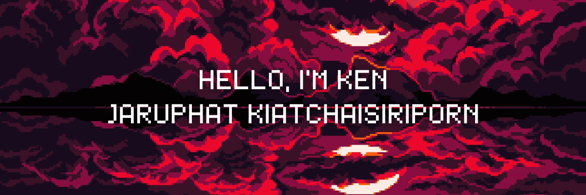

  

  

  

 

🎯 About Me
<table>
<tr>
<td align="center" width="50%">
🏫 Education
🎓 Bangkok University
📚 Computer Science Major
🏛️ School of IT & Innovation
</td>
<td align="center" width="50%">
🌟 Interests
💻 Full Stack Development
🎨 UI/UX Design
🤖 AI & Machine Learning
</td>
</tr>
</table>

🛠️ Tech Arsenal

💻 Programming Languages

  

🎨 Frontend Development

  

⚙️ Backend Development

  

🔧 Tools & Technologies

  

📊 GitHub Analytics

  <h3>📈 Performance Metrics</h3>
  
  

  <h3>🔥 Coding Streak</h3>
  

  <h3>📈 Contribution Activity</h3>
  

🏆 GitHub Achievements

  

📫 Let's Connect & Collaborate!

💌 Get In Touch
<table>
<tr>
<td align="center">
📧 Email
jaruphat536@gmail.com
</td>
<td align="center">
🌐 GitHub
@ttianqii
</td>
</tr>
</table>

📊 Profile Analytics

🐍 Contribution Snake

💭 Developer Quote

  

