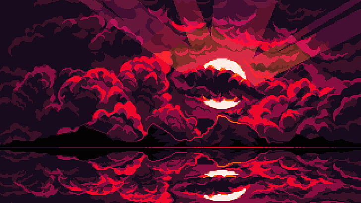

<html lang="en">
<head>
    <meta charset="UTF-8">
    <meta name="viewport" content="width=device-width, initial-scale=1.0">
    <title>GitHub Header</title>
    
</head>
<body>
    

        <!-- Using image from your GitHub repository -->
        
        

        

            <h1 class="pixel-font main-title">Hello, I'm Kenji</h1>
            <h2 class="pixel-font subtitle">Jaruphat Kiatchaisiriporn</h2>
        

    

</body>
</html>

  

 

  
### 🎓 About Me

**💼 BANGKOK UNIVERSITY【バンコク大学】💎**  
**💻 School of Information Technology and Innovation**  
**🎯 Computer Science Major**

---

## 🛠️ Tech Stack

**Programming Languages**

  

**Frontend Development**

  

**Backend Development**

  

**Design & Tools**

  

---

## 📊 GitHub Stats

  
  

---

## 🏆 GitHub Achievements

  

---

## 📫 Let's Connect!

**📧 Email:** jaruphat536@gmail.com

---

  

  

  

<!---
ttianqii/ttianqii is a ✨ special ✨ repository because its `README.md` (this file) appears on your GitHub profile.
You can click the Preview link to take a look at your changes.
--->
