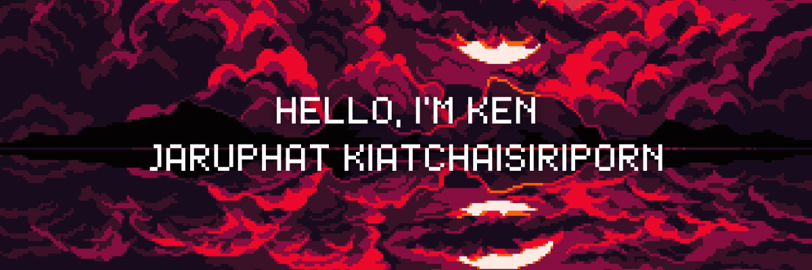

<!DOCTYPE html>

  

</img>

  

 

 🎓 About Me

**💼 BANGKOK UNIVERSITY【バンコク大学】💎**  
School of Information Technology and Innovation
Computer Science Major

</img>

## 🛠️ Tech Stack

**Programming Languages**  
   

**Frontend Development**  
          

**Backend & Database**  
      

**DevOps**  
 

**Design & Tools**  
          

---

## 📊 GitHub Stats

  
  

---

## 🏆 GitHub Achievements

  

---

## 📫 Let's Connect!

**📧 Email:** jaruphat536@gmail.com

---

  

  

  

